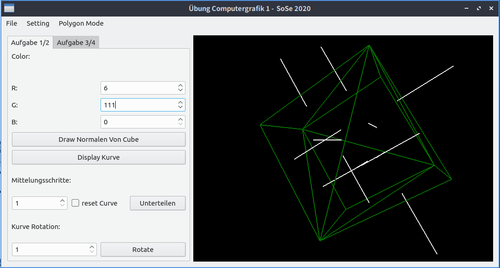
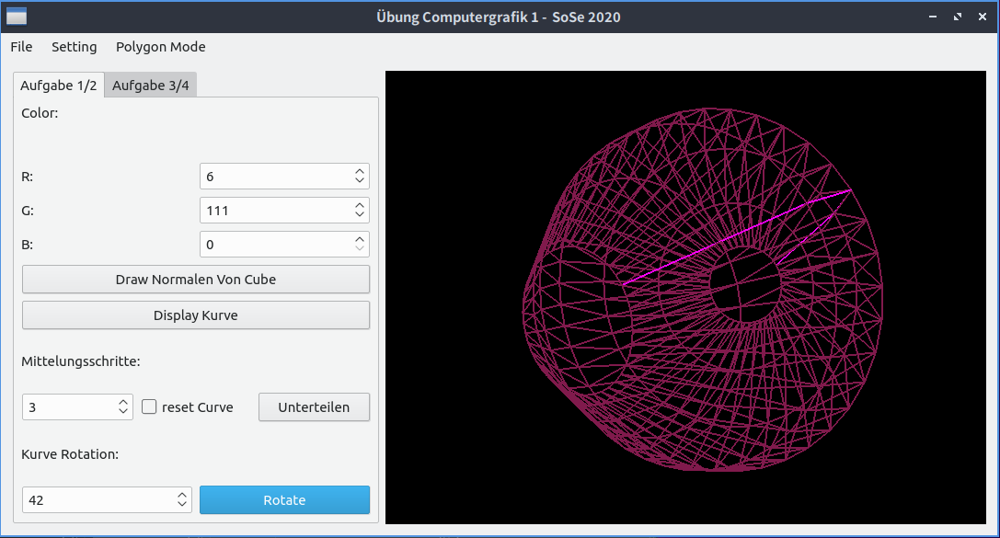
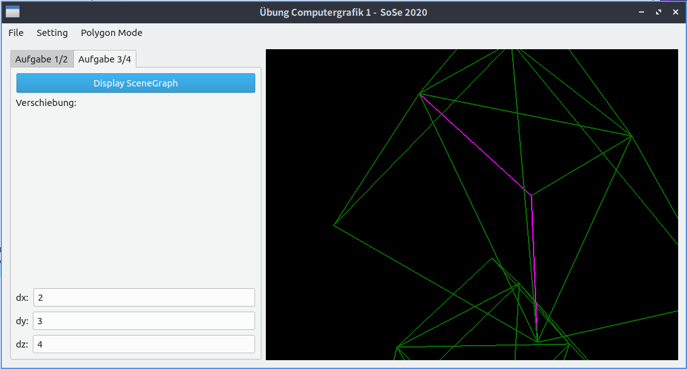

ComputerGrafik 1 - CG1 - SS20 - Übung 
---

## Bearbeiter/in
| Name | Vorname |
| ---- | ------- |  
| Luo  | Chang   |
---

## Screenshot

## Umfang (Was wir gemacht haben)
---
### Uebung_01
- Aufgabe 2 : Eigene Events an den Controller weiterleiten
- Aufgabe 3 : Erstes Objekt: Wurfel (1 Punkt) 
---

### Uebung_02
- Aufgabe 4 : Einfache Objekte - Rotationsobjekte mit Unterteilungskurven (1 Punkt)

Wir haben hier versucht, den Rotationskröper mit **Vierecke Netz und eine Kombi mit Drei und Vier** einzusetzen, aber der Render rendert jedoch das Objekt(CgPolygonalNetz bei uns nicht render, Grund unklar) leider nicht. Die Topologie sowie Geomertie haben wir gecheckt. (*CgRotationMitVierObject.cpp*)

Deshalb haben wir das Objekt mit **komplett Dreiecke Netz**(komplett TriangleMesh)durchsetzen. (*CgRotationObject*)

---

### Uebung_03
- Aufgabe 5 : Vervollständigung Mesh-Funktionalität (1 Punkt)
- Aufgabe 6 : Szene-Graph (1 Punkt)
---

### Uebung_04
- Aufgabe 6 : Transformationen: Skalierung, Verschiebung, Rotationen (2 Punkte)
---

Das war alles! Vielen Dank!
Wenn Sie mit unser Code nicht verstanden, bitte kontaktieren Sie uns!

> Mailto: [Chang Luo / Zhaoxi Wang](mailto:chang.luo@stud.hs-hannover.de?cc=chang.luo@gmx.de&subject=CG1_Uebung_Feedback)